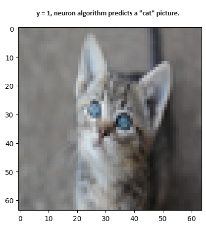
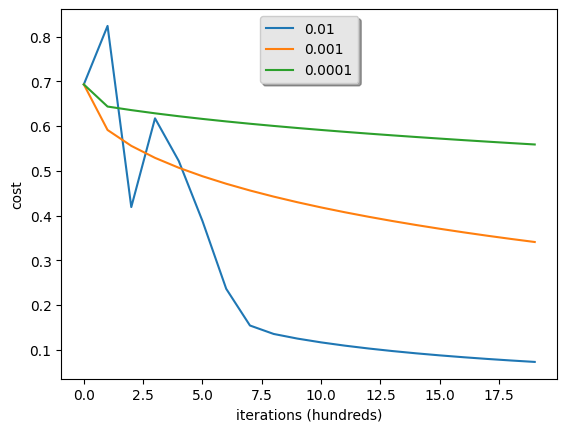

# p002-single-neuron-scratch-optimization
 Optimization of single vanilla neuron(logistic regression inspired); and run times are provided for binary classification task. Neuron is implemented using python without frameworks. Optimization is done by removing explicit for loops and implementing numpy vectorization and further optimized by numba on top of it. For this repository notes, click [📖](https://spicy-piranha-7fc.notion.site/Optimization-of-Single-Neuron-from-Scratch-375cd496bddf4de283bf68c00245d529?pvs=4). It is continuation of project [single neuron from scratch](https://github.com/ramayzoraiz/p001-single-neuron-scratch) and for basic understanding of neuron, refer to tutorial [:blue_book:](https://spicy-piranha-7fc.notion.site/Single-Neuron-from-Scratch-509cab06175948d193a16a0736e6bd1d?pvs=4).
  
  
 4 stages of epoch function optimization is done and time compared inside the file [neuron_optimize_main.ipynb](neuron_optimize_main.ipynb). epoch_2for function with nested “for” loops(highly unoptimized); outer for loop to go through all samples/objects and inner for loop for weight gradients for a sample. Next considered is  epoch_for function with single “for” loop(unoptimized) that iterates samples/objects. Further, numpy vectorization is used in epoch function and no “for” loop is used in. At last, numba python module is used to wrap numpy optimized code inside epoch_numba function(highly optimized).
  
|                   | epoch_nested_for_loop | epoch_single_for_loop | epoch_numpy_vectorization | epoch_numba |
| :---------------: |:-----------:| :----------:|:-----------:| :----------:|
| **Time (seconds)** |    2268.93 |       26.15 |    5.85     |        5.31 |

 
 

 File [cat_neuron_classifier.ipynb](cat_neuron_classifier.ipynb) contains numpy optimized neuron code from scratch and effect of learning rate is also discussed.
  
 
|  |  |

  
Folder testing[testing](testing) includes code in order to find more optimze method. Predict function run time by vectorizing is also tested.  

